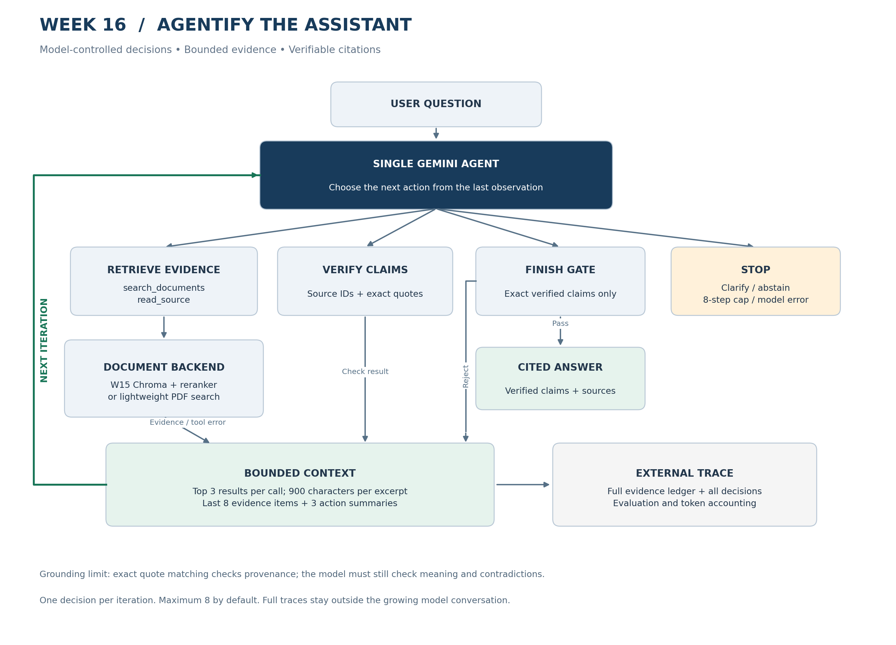

# Week 16 — Agentify the AI Engineering Assistant

**Student: Neev Badu | Fusemachines | Task 3**

This extends the existing Week 15 assistant with a **model-controlled evidence-checking loop**. Gemini can search again, read a source page, verify/revise claims, ask for clarification, abstain, or finish. Original Week 15 modules and the PDF are retained; the new Chroma backend reuses the existing vector store and reranker.

**Delivered validation:** 17 unit/integration checks and 10 offline evaluation cases pass. These use an explicit model test double. The currently saved live run passed 4 of 8 expected-behavior checks; three later calls returned HTTP 429 and a correction failed its content rubric. An earlier isolated correction retry passed. Offline scores are software checks, not LLM accuracy.

## Quick start — Windows PowerShell

Run these commands from the extracted project directory. Python 3.10+ is required; Python 3.11 is recommended to match the existing Dockerfile.

```powershell
python -m venv .venv
.\.venv\Scripts\Activate.ps1
python -m pip install -r requirements-week16.txt
python -m unittest evaluation.test_agent -v
python -m evaluation.run --mode offline
```

The offline evaluation needs no API key. It writes `evaluation/results/offline/report.md`, `results.json`, and `failures.json`.

For a real model run, copy `.env.example` to `.env` and fill in `GEMINI_API_KEY` and `GEMINI_MODEL` with values from your Google AI Studio account. The model ID is configurable so an unavailable model is never silently substituted.

```powershell
Copy-Item .env.example .env
# Edit .env before running the next commands.
python -m app.agentic.cli "When is Tier 3 used, and when must automatic healing be rejected?"
python -m evaluation.run --mode live
```

The default `pdf` backend reads the actual PDFs under `data/documents` and uses lightweight lexical search. To use the original W15 embeddings, Chroma, and cross-encoder instead:

```powershell
python -m pip install -r requirements-docker.txt
python -m app.rag.vector_store
python -m app.agentic.cli "When is Tier 3 used?" --backend chroma
```

W15's indexing command indexes `sample.pdf`; add other PDFs through the existing ingestion API before expecting Chroma to retrieve them. Model downloads are required for this backend. The default PDF backend automatically loads all PDFs in the directory.

## Assessed write-up (approximately one page)

### a. Context Engineering Technique

Repeated searches would append overlapping PDF chunks and tool output at every step. In `Agent.run`, each retrieval batch is capped at three items and each excerpt at 900 characters. The next model call contains only the last eight evidence items, three compact action summaries, and the latest observation. Stable evidence IDs and the full trace remain in an external Python ledger and are saved to JSON after the request. The `finish` action uses the last verified claim set directly, so rephrasing cannot silently change a checked claim. This limits prompt growth while retaining auditable evidence; older evidence may need retrieving again.

### b. Agentic Pattern

This is a **single-agent loop**. One model repeatedly chooses an action after reading the previous result. Missing evidence causes a new search or source read; failed quotation checks permit revision; ambiguous requests permit clarification. Eight decisions is the default stopping cap. A single agent fits the sequential dependency between research and verification. Multiple agents would add coordination tokens with little parallelization benefit. Deterministic quotation checks address mechanical citation errors, but the single-agent self-verification paradox remains for semantic interpretation.

### c. Evaluation Harness

`evaluation/run.py` is written from scratch without an evaluation framework. It runs actual `Agent` and document tools against ten offline cases: simple lookup, two-part research, correction, ambiguity, missing evidence, source conflict, timeout, malformed output, step exhaustion, and model failure. It records factual task completion, expected-behavior success, valid/appropriate tool calls, iterations, and failures. Hard failures prevent an answer; soft failures miss the task rubric; cascading soft failures follow an earlier bad intermediate result. Live mode uses the same first eight queries and real Gemini, without giving the model expected answers. Scoring uses explicit terms/source checks and needs manual semantic review. `--case` can rerun one failed live case; `--delay-seconds` spaces calls between cases.

### 1. Skill vs. Agent

A Skill could describe verification, but it cannot execute and adapt the research process; the loop is necessary. Search, page reading, and exact quotation checks need executable tools. Per-capability decisions and the one-sentence fixed-pipeline justification were recorded before coding in [DESIGN_DECISIONS.md](docs/DESIGN_DECISIONS.md). No additional agent was introduced.

### 2. Token and Cost Accounting

Every provider response contributes reported input, output, reasoning, and total tokens to the query ledger. The provider's total is used rather than assuming input plus visible output is complete. Missing usage is marked unknown. Offline replay consumes zero model tokens and is labeled accordingly. Optional per-million-token price arguments calculate estimated live cost; without supplied prices, cost remains unknown. There is no multi-agent coordination cost or need for a multi-agent baseline.

### 3. Failure Injection Test

`search_unavailable` raises a retrieval timeout; `malformed_once` returns an invalid result batch. Errors are exposed to the next model decision and invalid data never enters the evidence ledger. Offline traces demonstrate safe abstention on outage and recovery via `read_source` after malformed output. These demonstrate runtime safeguards; live-model recovery must be measured separately.

### 4. Tool vs. Agent Boundary

Chroma has persistent state, and retrieval includes embedding and reranking steps, but the assistant sees one bounded search operation returning at most three excerpts. Chroma does not pursue a goal, select subsequent tools, or negotiate with the model, so it is modeled as a tool rather than an agent-to-agent interaction. Gemini is the sole decision maker. Model HTTP calls have a 45-second timeout and no automatic retries; local retrieval performs bounded candidate work but has no hard wall-clock cancellation.

## Updated architecture



Editable sources: [Mermaid](docs/architecture.mmd), [Graphviz](docs/architecture.dot), [SVG](docs/architecture.svg).

## Deliverables

| Deliverable | Location |
|---|---|
| W15 assistant plus new feature | `app/`, `app/agentic/` |
| Updated README and assessed write-up | This file |
| Updated architecture diagram | `docs/architecture.png` and editable sources |
| Project summary document | `docs/Week16_Project_Summary.docx` |
| Evaluation harness source | `evaluation/run.py`, `cases.json`, `corpus.json`, `replay.py` |
| Results report and failure log | `evaluation/results/offline/` |
| Tests | `evaluation/test_agent.py` |
| Staged secret check | `scripts/check_staged_secrets.py` |
| Live run and isolated retry | `evaluation/results/live/`, `evaluation/results/live-retry/` |
| Requirements mapping, explanation, Nepali summary | [WEEK16_EXPLAINED.md](docs/WEEK16_EXPLAINED.md) |
| Preserved W15 documentation | [W15_README.md](docs/W15_README.md) |

## Results and interpretation

| Metric | Delivered offline result |
|---|---:|
| Expected behavior | 10/10 (100%) |
| Factual tasks completed | 5/10 (50%) |
| Tool-call correctness | 24/24 (100%) |
| Mean trajectory | 3.3 decisions |
| Regression tests | 17/17 passed |
| Real Gemini calls | See live report below |

Factual completion is lower because the suite intentionally includes clarification, unsupported questions, and injected failures. Safe abstention can pass the expected-behavior check without completing a factual task. The test double is explicitly scripted; it exercises software branches and does not establish model autonomy or quality. See the report and full traces for evidence.

The currently saved live run in `evaluation/results/live/report.md` used `gemini-3.5-flash-lite` on eight controlled-corpus queries. Expected behavior passed **4/8**; two cases produced verified factual answers, one requested clarification, and one safely abstained. Tool-call correctness was **11/11 (100%)** and the mean trajectory was **2.4** decisions. The correction case completed but failed its content rubric, while conflict and both injected-failure cases stopped on HTTP **429** before the injected tool behavior could be observed. These are provider-limit failures, not evidence that the recovery logic worked in that run. The separately saved correction retry in `evaluation/results/live-retry/report.md` passed in three decisions with 1,773 reported tokens. The full run has 8,950 known reported tokens; usage for failed HTTP calls is unknown. The live report is overwritten on every full rerun, so read it as a snapshot rather than a fixed benchmark.

## Live evaluation, costs, and failure demos

```powershell
python -m evaluation.run --mode live
python -m evaluation.run --mode live --delay-seconds 12
python -m evaluation.run --mode live --case revision --output evaluation/results/live-retry
python -m app.agentic.cli "Which framework controls Chromium?" --inject-failure search_unavailable
python -m app.agentic.cli "Which framework controls Chromium?" --inject-failure malformed_once
```

To estimate cost, append `--input-usd-per-million` and `--output-usd-per-million` with your model's applicable prices to the evaluation command. Live results are written separately under `evaluation/results/live/`; trace files from ad hoc requests go under `runs/`. Ad hoc traces under `runs/` are ignored by Git; the controlled-corpus live reports are included. Review generated results before sharing because traces contain source excerpts.

The evaluator uses a small controlled corpus: four excerpts verified against `sample.pdf` and two synthetic conflicting policies. This controls expected results but does not benchmark full-PDF semantic retrieval. Run the CLI with `--backend chroma` on your installed W15 environment to assess that integration.

## Limits and submission checklist

- Quote verification checks provenance, not semantic entailment. The model can still misinterpret a valid quotation.
- The live evaluation uses a controlled excerpt corpus and the production PDF CLI was smoke tested. W15 Chroma integration was not executed here because its model downloads and index were not available in this environment.
- The live rubric checks terms, cited pages, and exact quotations; manually review semantic support before treating answers as correct.
- Review the included explanation so you can demonstrate why the model's next action depends on the previous observation.
- The original repository README mentioned a vLLM notebook that was absent from the checked-out commit; this package does not invent that notebook.

Reference interfaces: [Gemini REST](https://ai.google.dev/api/generate-content), [usage accounting](https://ai.google.dev/gemini-api/docs/tokens).

