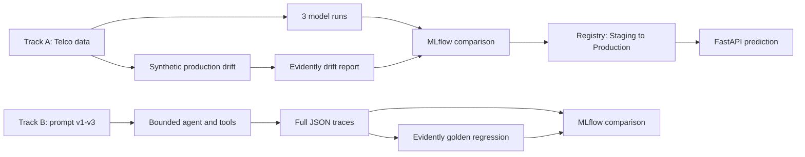

# Week 17 Assignment: MLOps for Predictive and Agentic AI

This submission implements both mandatory tracks from the assignment. Each track is an independent `uv` project with its own `pyproject.toml`, `.python-version`, and `uv.lock`.

## Repository links

- [Track A: Data Science MLOps](https://github.com/baduneev/fusemachine_learning_journey/tree/main/Week17_Assignment_Neev_Badu/track_a_churn)
- [Track B: Agentic AI MLOps](https://github.com/baduneev/fusemachine_learning_journey/tree/main/Week17_Assignment_Neev_Badu/track_b_agent)

The links become available after this folder is committed and pushed to the `main` branch.

## What the assignment does

The assignment applies the same production discipline to two kinds of AI systems:

1. **Track A** trains three churn classifiers, records comparable MLflow runs, registers and promotes the best model, serves it through FastAPI, and monitors feature and target drift with Evidently.
2. **Track B** versions an agent's prompts and execution limits, records complete tool traces in MLflow, diagnoses failures between versions, and uses an Evidently LLM-as-a-judge regression suite before selecting a prompt.



## Delivered results

### Track A

- Three genuine model configurations were trained and logged.
- `logistic_c_0_5` was selected by the declared rule: highest ROC-AUC, then F1.
- Winning test metrics: accuracy `0.7518`, precision `0.5210`, recall `0.7966`, F1 `0.6300`, ROC-AUC `0.8461`.
- `TelcoChurnBest` version 1 was moved through **Staging** and **Production**, with alias `champion`.
- Evidently detected the deliberately introduced drift in `MonthlyCharges`, `Contract`, and `Churn`.
- The custom Evidently metric measured a `34.10` absolute (`52.51%`) increase in mean monthly charges.

### Track B

- Five full traces were recorded for each of three explicit prompt versions.
- Behavior pass rate improved from `0%` to `60%` to `100%`.
- The identical three case golden set was rerun after every prompt change.
- Gemini based Evidently judges measured joint correctness and completeness pass rates of `0%`, `66.67%`, and `100%`.
- The judge agreed with all nine human expected labels in the delivered sanity check.
- Prompt v3 is selected for quality. It used `3,903` replay tokens versus `1,884` for v2, so the report records the quality and cost tradeoff.

## Submission contents

| Requirement | Evidence |
|---|---|
| Separate reproducible environments | `pyproject.toml`, `.python-version`, and `uv.lock` in each track |
| Track A MLflow comparison | `track_a_churn/outputs/run_comparison.md` and local `mlruns.db` |
| Registered model and stages | `track_a_churn/outputs/registry_info.json` |
| Track A Evidently HTML | `track_a_churn/outputs/evidently_drift_report.html` |
| Track A custom metric | `track_a_churn/src/custom_metrics.py` and `outputs/drift_summary.json` |
| Track B prompt versions | `track_b_agent/prompts/prompt_v1.txt` through `prompt_v3.txt` |
| Full representative traces | `track_b_agent/mlops/outputs/prompt_v*/trace_*.json` |
| Track B MLflow comparison | `track_b_agent/mlops/outputs/prompt_comparison.md` and local `mlruns.db` |
| Track B golden set | `track_b_agent/mlops/golden_set.json` |
| Track B Evidently HTML | `track_b_agent/mlops/outputs/evidently_llm_regression.html` |
| Judge pass rates and sanity check | `llm_regression_summary.md` and `judge_sanity_check.json` |

Airflow orchestration was optional in the assignment and is not included. Small sequential entry points are provided in each track instead.

## Reproduce the submission

Run each block from its track folder.

```powershell
# Track A
cd track_a_churn
uv sync --locked
uv run python -m src.train
uv run python -m src.monitor
uv run pytest -q
```

```powershell
# Track B
cd ../track_b_agent
Copy-Item .env.example .env
# Add GEMINI_API_KEY and GEMINI_MODEL to .env
uv sync --locked
uv run python -m mlops.run_experiments
uv run python -m mlops.run_llm_regression
uv run pytest -q
```

More detailed commands and interpretation are in each track's README.

## Safe submission checklist

- Do not add either track's `.env` file.
- Commit the lockfiles and generated reports.
- Stage only `Week17_Assignment_Neev_Badu/` so unrelated working tree files are not included.
- Run `python track_b_agent/scripts/check_staged_secrets.py --staged` after staging and before committing.
- Push the commit, then confirm both GitHub links above open.
