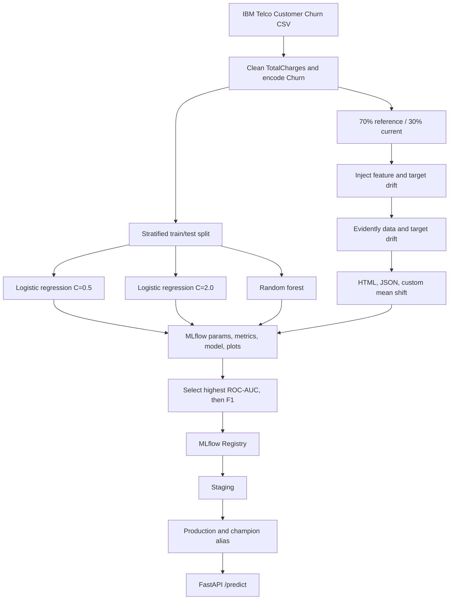

# Track A: Telco Churn MLOps

## A. Reproducible environment

This project uses Python 3.11 and `uv`. Dependencies are declared in `pyproject.toml` and resolved exactly in `uv.lock`.

```powershell
cd Week17_Assignment_Neev_Badu/track_a_churn
uv sync --locked
```

`uv sync --locked` verifies that the lockfile matches the project declaration. No API key is required for Track A.

## System architecture



## B. Experiment tracking strategy and results

Every candidate uses the same cleaned dataset, split seed, 75/25 train/test split, preprocessing, and evaluation code. The model or a meaningful hyperparameter changes between runs. MLflow records parameters, accuracy, precision, recall, F1, ROC-AUC, fit time, fitted model, confusion matrix, and ROC curve.

```powershell
uv run python -m src.train
```

| Run | Accuracy | Precision | Recall | F1 | ROC-AUC |
|---|---:|---:|---:|---:|---:|
| Logistic regression, C=0.5 | 0.7518 | 0.5210 | 0.7966 | 0.6300 | **0.8461** |
| Logistic regression, C=2.0 | 0.7501 | 0.5188 | 0.7966 | 0.6284 | 0.8459 |
| Random forest, 300 trees, depth 8 | **0.7649** | **0.5391** | 0.7816 | **0.6381** | 0.8448 |

The declared selection rule is highest ROC-AUC, with F1 as the tie breaker. It selected `logistic_c_0_5`. The random forest had slightly better accuracy and F1, but its ROC-AUC was lower. This illustrates why a promotion criterion must be chosen before comparing runs.

The winner was registered as `TelcoChurnBest` version 1, transitioned from **Staging** to **Production**, and assigned the `champion` alias. The exact record is in `outputs/registry_info.json`.

```powershell
uv run mlflow ui --backend-store-uri sqlite:///mlruns.db --default-artifact-root ./mlartifacts --port 5000
```

Open `http://127.0.0.1:5000`.

## Serve the Production model

The service loads `models:/TelcoChurnBest/Production` from the local registry.

```powershell
uv run uvicorn src.serve:app --host 127.0.0.1 --port 8000
```

```powershell
Invoke-RestMethod http://127.0.0.1:8000/health
```

Example prediction:

```powershell
$body = @(@{
  gender='Female'; SeniorCitizen=0; Partner='Yes'; Dependents='No'; tenure=12;
  PhoneService='Yes'; MultipleLines='No'; InternetService='Fiber optic';
  OnlineSecurity='No'; OnlineBackup='Yes'; DeviceProtection='No'; TechSupport='No';
  StreamingTV='Yes'; StreamingMovies='No'; Contract='Month-to-month';
  PaperlessBilling='Yes'; PaymentMethod='Electronic check';
  MonthlyCharges=89.10; TotalCharges=1069.20
}) | ConvertTo-Json
Invoke-RestMethod -Method Post -Uri http://127.0.0.1:8000/predict -ContentType application/json -Body $body
```

## C. Monitoring and drift analysis

```powershell
uv run python -m src.monitor
```

The source dataset is split into a 70% reference set and 30% simulated current set. The current set receives three controlled changes:

- `MonthlyCharges` is shifted by a draw from `Normal(35, 5)`.
- 55% of current rows are assigned `Month-to-month` contracts.
- Churn labels are flipped for 15% of the entire current population.

Evidently detected drift in all three deliberately changed columns. Churn prevalence rose from `26.53%` to `41.50%`. The custom Evidently metric reports the monthly charge mean changing from `64.95` to `99.05`, an absolute shift of `34.10` or `52.51%`.

The result is an alert to investigate billing and contract data sources. Validate the input pipeline and repeat the analysis on later windows before retraining.

Artifacts:

- `outputs/evidently_drift_report.html`: interactive deliverable.
- `outputs/evidently_drift_report.json`: machine readable report.
- `outputs/drift_summary.json`: selected results and interpretation.
- `outputs/reference_sample.csv` and `current_with_synthetic_drift.csv`: reproducible inputs.

## Verification

```powershell
uv run pytest -q
```
