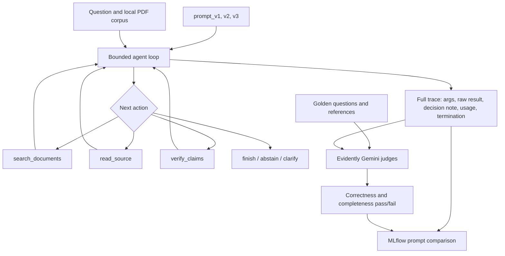

# Track B: Agentic AI MLOps

This track applies experiment tracking and regression testing to the bounded document agent from Week 16. The agent can search local document evidence, read a page, verify claims, finish, clarify, or abstain. Every action is schema checked and the agent cannot finish until its claims pass deterministic evidence verification.

## A. Reproducible environment

```powershell
cd Week17_Assignment_Neev_Badu/track_b_agent
uv sync --locked
Copy-Item .env.example .env
```

Add a local Gemini key and an available model ID to `.env`. The file is ignored by Git.

```dotenv
GEMINI_API_KEY=your_key_here
GEMINI_MODEL=your_model_id_here
```

The project uses Python 3.11. Its exact dependency resolution is stored in `uv.lock`.

## System architecture



## B. Prompt experiment strategy and actual comparison

Three prompts are explicit versioned files under `prompts/`. The delivered experiment uses a deterministic replay provider so failures, recovery branches, and token accounting remain reproducible. This provider is tagged in MLflow and is not presented as live production quality. The existing `GeminiModel` remains available for live agent runs.

```powershell
uv run python -m mlops.run_experiments
```

Each version receives the same five cases: a simple lookup, multi-part research, correction after failed verification, unsupported information, and a simulated search outage. Five complete JSON traces are saved per version, exceeding the assignment's two to three representative trace minimum.

| Prompt | Main change | Behavior pass | Completion | Mean iterations | Token total |
|---|---|---:|---:|---:|---:|
| v1 | Generic search, verify, finish policy | 0% | 0% | 4.0 | 2,291 |
| v2 | Requires verification and bounded recovery | 60% | 40% | 2.6 | **1,884** |
| v3 | Targeted follow-up search, verification repair, alternate tool recovery | **100%** | **80%** | 3.2 | 3,903 |

Failure diagnosis and revision:

- **v1:** it attempted to finish without a verified claim. The guardrail rejected the finish and the four step budget expired.
- **v2:** verification fixed the simple case, but correction recovery abstained too early and multi-part searches could still omit evidence.
- **v3:** it performs a targeted second search for missing evidence, repairs rejected claims, and falls back to direct source reading after a search outage.

Prompt v3 is the quality winner. Prompt v2 is cheaper, but its 60% behavior pass rate and 66.67% golden regression rate are insufficient for promotion. Prompt v3's additional tool calls increase cost while raising both delivered gates to 100%.

Every trace includes:

- iteration number and model decision note;
- selected tool action and arguments;
- the raw selected search/read result or verifier result;
- success or error observation;
- cumulative evidence and claims;
- per-step token usage and termination status.

Open MLflow:

```powershell
uv run mlflow ui --backend-store-uri sqlite:///mlruns.db --port 5001
```

Then open `http://127.0.0.1:5001` and select `agent-prompt-comparison`.

## C. Evidently golden regression monitoring

The shared three case set in `mlops/golden_set.json` contains the question, golden response, and source context. The same set is applied to all three prompt versions.

```powershell
uv run python -m mlops.run_llm_regression
```

Two Evidently LLM checks are used:

1. **Reference correctness:** does the answer convey the golden answer without contradiction, unsupported additions, or material omission?
2. **Answer completeness:** does the answer cover the required facts in the supplied source context?

| Prompt | Correctness | Completeness | Both tests pass |
|---|---:|---:|---:|
| v1 | 0% | 0% | 0% |
| v2 | 66.67% | 66.67% | 66.67% |
| v3 | **100%** | **100%** | **100%** |

The v1 failures are refusals caused by its exhausted step budget. V2 passes simple and research answers but fails the correction case because it abstains before returning the verified correction. V3 passes all golden cases.

LLM judges can be inconsistent, so the submission compares the combined judge verdict with human expected labels. The delivered judge agreed on all 9 rows. This is a small sanity check; expand the set before using the score as a production release gate.

The per-version percentage of tests passed is logged back to the same MLflow prompt run. Artifacts include:

- `mlops/outputs/evidently_llm_regression.html`;
- `mlops/outputs/llm_judge_row_results.csv` with categories and judge reasoning;
- `mlops/outputs/llm_regression_summary.md`;
- `mlops/outputs/judge_sanity_check.json`.

## Verification

```powershell
uv run pytest -q
```

To inspect a live agent run after configuring `.env`:

```powershell
uv run python -m app.agentic.cli "Which framework controls Chromium?"
```

Before committing, stage the intended folder and scan staged content:

```powershell
git add Week17_Assignment_Neev_Badu
python Week17_Assignment_Neev_Badu/track_b_agent/scripts/check_staged_secrets.py --staged
```
